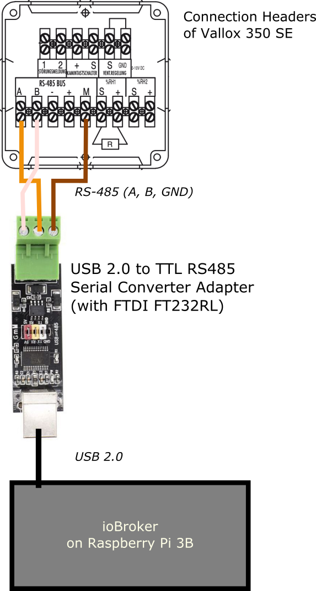

# ioBroker.valloxSerial

---
For this adapter development has just started. Please don't use it and don't file any issues yet.
Stay tuned...
---


## Description
This is an [ioBroker](http://iobroker.net) adapter. It is used to read settings and data as well as to change settings of Vallox ventilation units of type SE. I.e., units that are controlled electronically via the legacy Vallox RS-485 serial protocol.

If you are looking for an adapter for a Vallox MV unit, please refer to [ioBroker.valloxmv](https://github.com/hacki11/ioBroker.valloxmv).

# Disclaimer / Warning
This adapter is provided 'as is' with no guarantee of proper function. Use at own risk. 

## Supported (tested) Units
I'm developing and testing this adapter with my Vallox ventilation unit which is a **Vallox 350 SE**. Beside the main unit there is one wired control unit (FBD 382 LCD).

The adapter might work with similar units. Provided the serial protocol is the same.

## Hardware and Wiring

### RS-485 Connection
Vallox units with a legacy electronic control employ a 5-wire RS-485 bus. "RS-485 does not define a communication protocol; merely an electrical interface." (Source: [Wikipedia](https://en.wikipedia.org/wiki/RS-485)).


| Wire  | Color     | Meaning        |
| ----- |-----------|----------------|
| A     | orange 2  | RS-485: A      |
| B     | white 2   | RS-485: B      |
| -     | white 1   | - of 21 VDC power supply for Vallox devices |
| +     | orange 1  | + of 21 VDC power supply for Vallox devices |
| M     | metal     | RS-485: Ground |
(Source: [Vallox KWL Digit SE/SE VKL Technische Anleitung](https://vallox.de/Downloads/Archiv/digitSE/DIGIT-SE-Technik_f092003.pdf))

### Wiring
There are 485 to TTL to USB converter with a FTDI FT323RL chip available that make wiring very easy and straight forward.


### Driver Install on Raspberry Pi / Linux
This [video](https://youtu.be/DXgvaibDJzo) shows how to install the RS-485 to USB converter with the FT232 chip under Linux (and therefore, for Raspbian).
1. Plug in the converter
2. `lsusb | grep FT232` for a list of USB devices (for me the entry looked like ```Bus 001 Device 006: ID 0403:6001 Future Technology Devices International, Ltd FT232 USB-Serial (UART) IC``` the colon separated numbers are the vendor and the product IDs repectively).
3.  `modprobe usbserial vendor=0x0403 product=0x6001` (with my vendor and product ID from `lsusb`)
4. Check with `dmesg | grep ttyUSB` (should tell you that there's a FTDI device attached to ttyUSB)
5. Make interface public: `chmod 777 /dev/ttyUSB0`
6. Check if ttyUSB0 is set to serial config of 9600,N,8,1 (9600 bauds, no stopbit, 8 data bits, 1 stop bit): `stty -a -F /dev/ttyUSB0` or just set it `stty -F /dev/ttyUSB0 9600 cs8 -cstopb -parenb`
7. See if data is coming in `xxd -c 6 -g 1 -u /dev/ttyUSB0`


## Protocol

### Serial Config
9600,N,8,1 (9600 bauds, no stopbit, 8 data bits, 1 stop bit).

### Checksum
Add all bytes in the packet. The least 8 bits, i.e. the lower byte, is the checksum.

## Sources

* You may find a Vallox documentation in Finish [here](https://docplayer.fi/42549060-Vallox-digit-vaylaprotokolla.html)

* The Loxone project offer a very good english protocol description [PDF](https://www.loxwiki.eu/download/attachments/918242/Digit_protocol_english_RS485.pdf)

* The FHEM project provides a documentation of the protocol as well [https://wiki.fhem.de/wiki/Vallox]

## TODOs
* Stuff


## Rework later...
[](https://www.npmjs.com/package/iobroker.template)
[](https://www.npmjs.com/package/iobroker.template)


[](https://david-dm.org/Author/iobroker.template)
[](https://snyk.io/test/github/Author/ioBroker.template)


## Changelog
 
### 0.0.1
* (Author) initial release

## License

License information can be found [here](./LICENSE)